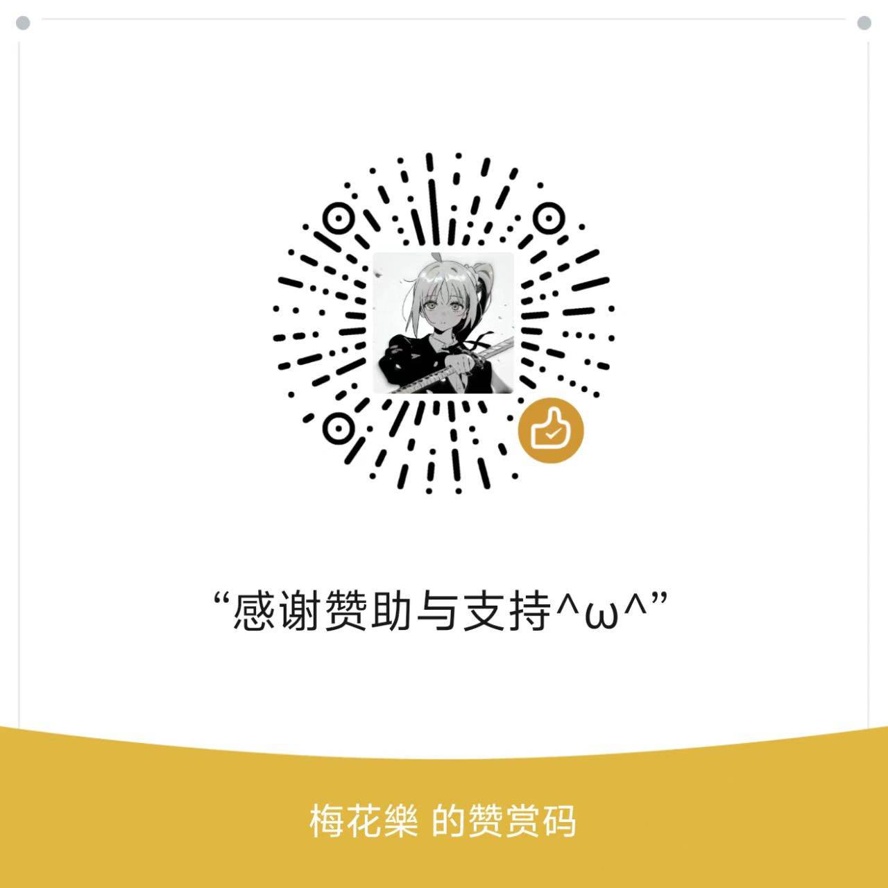

# 开发支持与资源获取

::: tip 重要提示：
- 所有捐赠仅为技术支持，与获取本软件和使用本软件无关
- 捐赠行为不代表获得软件永久使用权
- 禁止以捐赠名义进行版本转售（违者封禁设备指纹）
- 捐赠者仍需签署《SecBot最终用户协议》
- 账号异常时优先保障捐赠者服务（数据恢复/配置迁移）
:::

## 捐赠说明
🌟 **优先获取权益**（仅限内测阶段）
- 捐赠任意金额可享：
  - 新版本48小时优先体验
  - 专属问题响应通道（<2小时）
  - 定制化配置支持

## 支付渠道
▌ 扫码捐赠（推荐使用支付宝/微信客户端扫码）

  
  

⚠️ 支付备注规范：
- 必须包含：QQ号/微信ID + 姓名首字母
- 示例：123456789_ABCD

## 阶梯式支持方案
▌ 基础支持（￥6.6起）
- 更新日志特别致谢名单
- 定制化昵称显示（客户端内）

▌ 进阶支持（￥30）
- 定制化配置支持
- 崩溃日志实时推送

▌ 战略支持（￥100）
- 年度技术报告订阅（含安全防护建议）
- 私有化部署咨询（限本地环境）

## 法律声明

1. 本捐赠为自愿技术支持行为，与工具获取无直接关联；所有赞助行为视为对本项目的捐赠
2. 所有款项用于：
   - 服务器维护（阿里云ECS基础版）
   - 安全检测服务（每月WAF防护）
   - 自动化测试设备（云真机调试）
3. 开具电子收据：
   - 捐赠满50元可邮件申请
   - 发送至：BLTSitegroup@163.com
   - 请注明：捐赠金额 + 捐赠人QQ/微信ID + 姓名首字母

> 注：本机制符合《网络安全法》第22条关于开源技术支持的规范